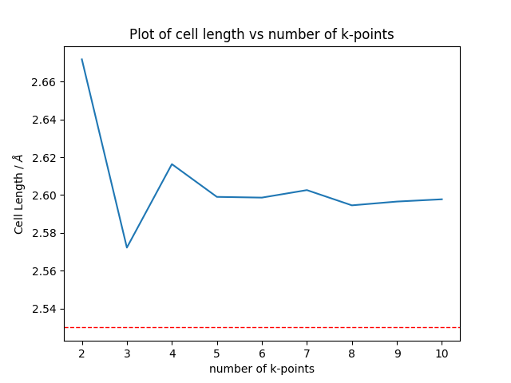
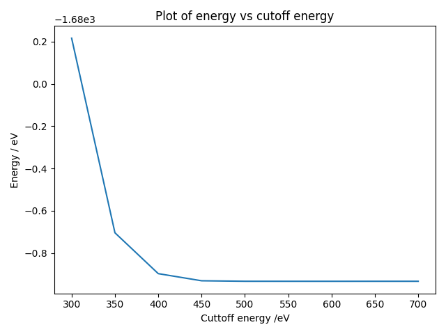
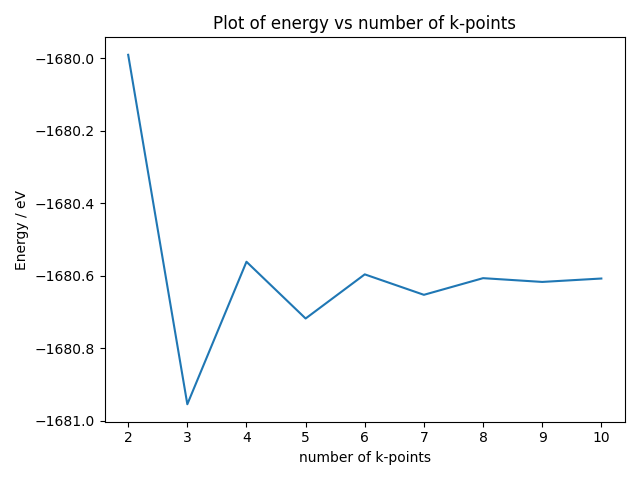
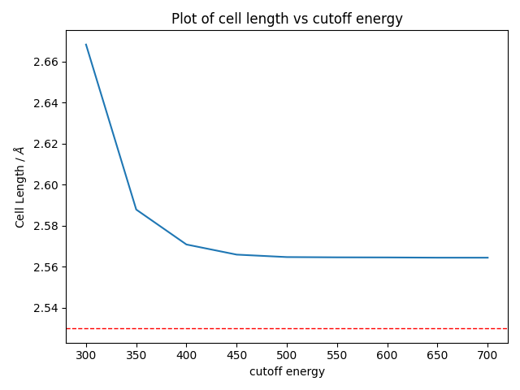

# Bulk Convergence

## 4 Plots on convergence test

the red horizontal line indicates the databook value of Cu bond length(2.53)

### cell_length_against_n_k_points:

### cell_length_against_cutoff_energy:

cell_length_against_n_k_points

### energy_against_n_k_points:

### energy_against_cutoff_energy:

