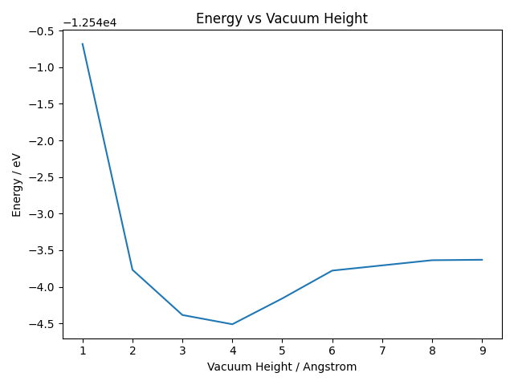
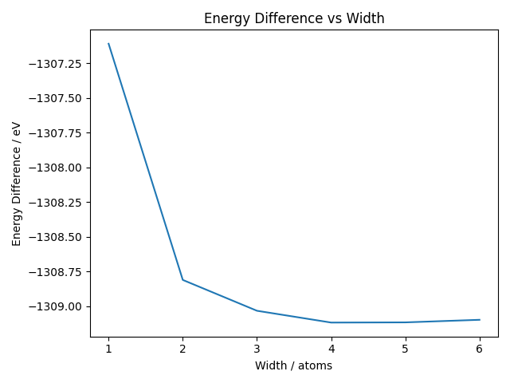

## Cutoff Energy

As an adsorbate is introduced here, the cutoff energy should be the higher one between the adsorbate atom and the slab atom.
The `EXTREME` setting in the `.usp` file generated by
CASTEP givens a cutoff energy of K as $479 eV$

```
 245 COARSE
 272 MEDIUM
 299 FINE
 479 EXTREME
```

which is smaller than $600 eV$ for copper, so $600 eV$ is chosen as the cutoff energy.

this file can be generated by calling

```bash
castep.serial --dryrun <task_name>
```

## Vacuum Height Convergence

We determine the minimum vacuum height required to treat the slab withas a surface. This time an adsorbate is introduced so the result might be different. The goal is to ensure that the Cu slab in each layer together with the adsorbate atom is unaffected by the periodic repetition of the slab above and below the vacuum layer.

This is done by performing a series of CASTEP energy calculations with varying vacuum height and analyzing how the total energy varies with height of vacuum layers.



## Slab Width Convergence

Relative to the adsorbate which is a single atom, the slab should be very large to represent a physical surface, since the edge of a small slab will certainly affect the adsorbate if the slab is too small in the x-y direction. A convergence test on how wide the slab should be is therefore performed. Here the converged quantity to be tested is the energy difference between a slab with an adsorbate and a slab with no adsorbate, using the energy of slab with adsorbate calculated here and the energy of plain slab calculated in slab part.



It can be seen that convergence takes place when slab width is around 4-atom wide and vacuum height is 8.
