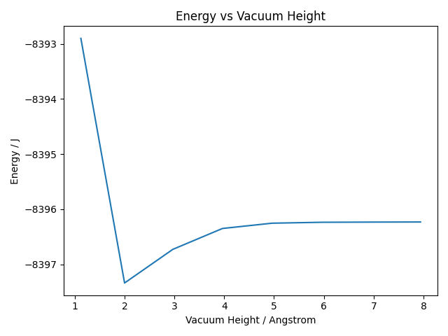
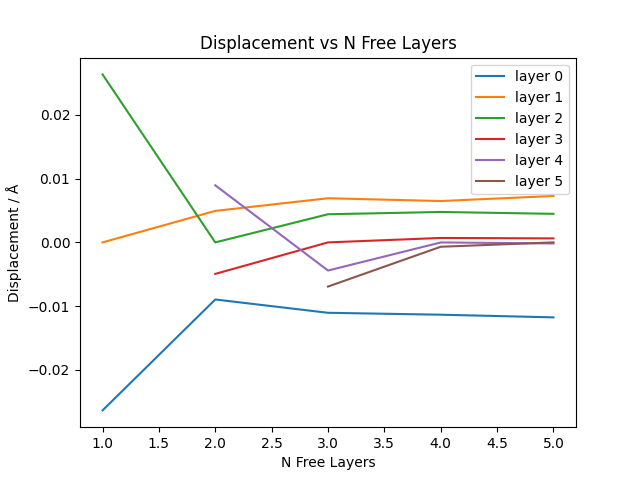

# Slab Convergence

Given the bulk lattice of Cu, we can generate a slab with a layer of vacuum between
the layers.

The initial slab configuration is shown below

## Vacuum Height Convergence

Next, we determine the minimum vacuum height required to treat the slab as a surface. The goal is to ensure that the Cu slab in each layer is unaffected by the periodic repetition of the slab above and below the vacuum layer.

This is done by performing a series of CASTEP energy calculations with varying vacuum height and analyzing how the total energy varies with height of vacuum layers.

## Free Layer Convergence

The slab given above doesn't represent the real surface, since the layers at the top of the surface experience very different forces (more atoms below than above) compared to the layers in the middle. Therefore, the layers at the top should be free to move in the vertical direction, while the bottom layers kept fixed during calculation. We set the number of fixed layers to be 1 more than the number of free layers for the lowest free layer to experience more forces from bottom atoms than from top atoms (which ensures it is a layer near the top rather than in the middle). Calculation is then performed and the convergence of free atom displacement is tested against the number of free layers.

Convergence is achieved when there are more than 3 free layers. Therefore, the slab is prepared with 6 angstrom of vacuum, 3 free layers and 4 fixed layers.

## n_width Slab Preparation

Here we also prepared slabs with different widths for calculation of energy. This energy is then compared with the energy of slabs with adsorbate to test the convergence of energy difference with respect to slab width.
