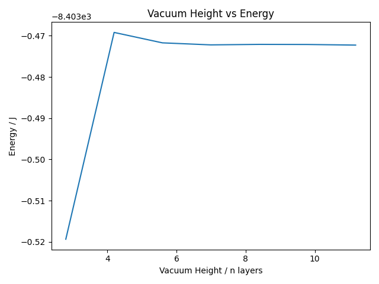

# Slab Convergence

Given the bulk lattice of Cu, we can generate a slab with a layer of vacuum between
the layers.

The initial slab configuration is shown below

## Vacuum Layer Convergence

Next, we determine the minimum number of vacuum layers required to treat the slab as a surface. The goal is to ensure that the Cu slab in each layer is unaffected by the periodic repetition of the slab above and below the vacuum layer.

This is done by performing a series of CASTEP energy calculations with varying vacuum layer thicknesses and analyzing how the total energy varies with the number of vacuum layers.

