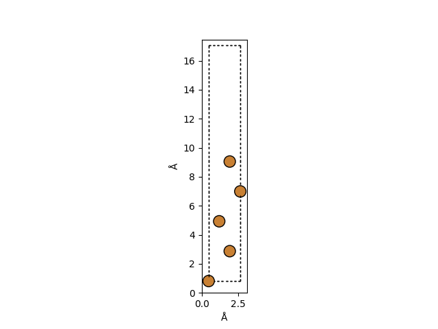

# Slab Convergence

After generating the bulk lattice of Cu, we use it to create a slab of Cu with vaccum layer stacked above it. First we test how many vaccum layers are enough for the system to viewed as a surface such that the slab in each layer is not influenced by the repeated cu slab above and below the vaccum layer

The initial slab configuration is as follows.

## Vacuum Layer Convergence

This involves performing a series of calculations with varying vacuum layer thicknesses and analyzing how the energy changes with respect to the number of vacuum layers.

